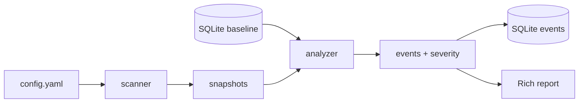

# File Integrity Monitor (FIM)

A Python CLI tool for file integrity monitoring on Linux. It compares the current state of files against a **baseline** (trusted state) stored in SQLite, detects content and metadata changes, and reports them with an assigned severity level.

> **MVP:** on-demand scanning (no daemon). Target environment: Kali Linux.

---

## Table of contents

- [Features](#features)
- [Requirements](#requirements)
- [Installation](#installation)
- [Quick start](#quick-start)
- [Configuration](#configuration)
- [CLI commands](#cli-commands)
- [Event types and severity](#event-types-and-severity)
- [Exit codes](#exit-codes)
- [Project structure](#project-structure)
- [Tests](#tests)
- [Kali demo](#kali-demo)

---

## Features

- Recursive file and directory scanning (SHA-256, metadata: `mode`, `uid`, `gid`, `mtime`)
- SQLite baseline as the reference for subsequent scans
- Change detection: new/deleted files, content modifications, metadata changes
- Alert levels: `CRITICAL`, `HIGH`, `MEDIUM`, `LOW` (YAML rules or `alerts` profile)
- Terminal reports (Rich) plus JSON and HTML export
- Simple Tkinter GUI (`gui` command)
- Selective baseline extension (`add-baseline`) without replacing the entire baseline
- Single-file verification (`verify`) without writing alerts to the database
- Explicit exit codes for scripts and cron integration

---

## Requirements

- Python **3.10+**
- Linux (recommended: **Kali Linux**)
- Root privileges only when monitoring system paths (`/etc`, etc.)

---

## Installation

```bash
git clone https://github.com/filipniemczyk/file-integrity-monitor.git
cd file-integrity-monitor

python -m venv .venv
source .venv/bin/activate
pip install -r requirements-dev.txt
```

---

## Quick start

Simple local demo (**no root**), using `./watched`:

```bash
mkdir -p watched
echo "baseline" > watched/a.txt

python -m fim init --config config.example.yaml
echo "change" >> watched/a.txt

python -m fim scan --config config.example.yaml
python -m fim report --config config.example.yaml
```

After `scan`, check the exit code: `echo $?` → `1` means changes were detected, `0` means no changes.

---

## Configuration

| File | Purpose |
|------|---------|
| [`config.example.yaml`](config.example.yaml) | Local demo (`./watched`), works without root |
| [`config.security.yaml`](config.security.yaml) | Linux security profile: `/etc`, `systemd`, user files (`/home/*/…`) |
| [`config.severity-demo.yaml`](config.severity-demo.yaml) | Short severity-level demo on Kali |

### YAML sections

```yaml
monitor:
  paths:          # what to scan (globs supported, e.g. /home/*/.bashrc)
    - ./watched
  exclude:        # legacy list, or:
    paths:        #   full paths: /proc, /tmp, …
      - /proc
    patterns:     #   patterns: *.log, .git, __pycache__
      - "*.log"

database:
  path: fim.db

hash:
  algorithm: sha256

alerts:           # mapped to severity.rules (config.security.yaml)
  critical: [/etc/shadow, …]
  high:     [/etc/passwd, …]
  medium:   [/etc/hosts, …]
  low:      [./watched, …]
```

Security profile (requires `sudo`):

```bash
sudo python -m fim init --config config.security.yaml
sudo python -m fim scan --config config.security.yaml
```

---

## CLI commands

All commands accept `--config` / `-c` (default: `config.example.yaml`).

| Command | Description |
|---------|-------------|
| `init` | Create baseline (full scan and save to database) |
| `scan` | Scan, compare with baseline, save events |
| `verify` | Check a **single** file against baseline (no alert persistence) |
| `add-baseline` | Add file/directory to baseline without full `init` |
| `list-baseline` | Display current baseline (Rich table, read-only) |
| `report` | Event history from database |
| `export-html` | Export event history to a standalone HTML file |
| `gui` | Launch graphical interface (Tkinter) |

### `init` / `scan`

```bash
python -m fim init --config config.example.yaml
python -m fim scan --config config.example.yaml
```

`scan` prints an event table and summary (file count, duration, event types, severity).

### `list-baseline`

```bash
python -m fim list-baseline --config config.example.yaml
python -m fim list-baseline --config config.example.yaml --limit 20
python -m fim list-baseline --config config.example.yaml --contains ssh
python -m fim list-baseline --config config.example.yaml --full-hash
```

Columns: path, SHA-256 (short or full), size, `mode`, `uid`, `gid`, `mtime`.

### `add-baseline`

Adds selected paths without overwriting the rest of the baseline:

```bash
python -m fim add-baseline --path watched/new.txt --config config.example.yaml
python -m fim add-baseline --path watched/dir --recursive --config config.example.yaml
python -m fim add-baseline --path watched/file.txt --force --config config.example.yaml
```

- Directories require `--recursive`
- Without `--force`, existing records are skipped
- Summary: added / skipped / overwritten

### `verify`

```bash
python -m fim verify --path watched/a.txt --config config.example.yaml
```

Possible statuses: `OK`, `MODIFIED`, `DELETED`, `NOT_IN_BASELINE`, metadata types (`MTIME_CHANGED`, `PERMISSION_CHANGED`, …).

### `report`

```bash
python -m fim report --config config.example.yaml
python -m fim report --config config.example.yaml --json reports/report.json
python -m fim report --config config.example.yaml --html reports/report.html
```

### `export-html`

```bash
python -m fim export-html --config config.example.yaml -o reports/report.html
```

Opens a self-contained HTML page with event table, severity summary, and optional scan stats.

### `gui`

```bash
python -m fim gui --config config.example.yaml
# or
python -m fim.gui
```

The GUI uses the **same YAML config** and **same SQLite database** as the CLI. It is a scan-on-demand desktop helper, not a background daemon.

**Requirements:** graphical session (X11/Wayland), Python `tkinter` (`python3-tk` on Kali).

**Features:**

| Area | Actions |
|------|---------|
| Configuration | Browse/load YAML, read-only preview of paths, exclude, database, severity |
| Baseline | Create baseline (init), browse baseline with filters |
| Scan | Run scan, view statistics, update alerts table |
| Alerts | Load via **Apply filters** (same as `fim report`), filter by limit/type/severity; double-click for details |
| Verify | Check one file against baseline (no DB write) |
| Add to baseline | Add file/directory with recursive/force/reason |
| Export | JSON or HTML for current/filtered alerts |
| Log | Operation progress, errors, warnings (bottom panel) |

Long operations (`init`, `scan`) run in a **background thread** so the window stays responsive.

**`config.security.yaml`:** the GUI shows a warning that system paths may require `sudo` and that some files can be skipped. The GUI does **not** run `sudo` automatically.

---

## Event types and severity

### Event types

| Type | Meaning |
|------|---------|
| `CREATED` | File appeared after baseline was created |
| `DELETED` | Baseline file is missing |
| `MODIFIED` | Content hash changed |
| `PERMISSION_CHANGED` | `mode` changed |
| `OWNER_CHANGED` | `uid` changed |
| `GROUP_CHANGED` | `gid` changed |
| `SIZE_CHANGED` | Size changed (same hash) |
| `MTIME_CHANGED` | Modification time changed |
| `METADATA_CHANGED` | Multiple metadata fields changed at once |

When the hash changes, only `MODIFIED` is emitted (no separate metadata events for the same operation).

### Severity

When `severity` or `alerts` is configured, the level depends on the **file path** (highest matching rule wins):

`CRITICAL` > `HIGH` > `MEDIUM` > `LOW`

Without a severity section, legacy defaults apply (e.g. `/etc/shadow` → `CRITICAL`, event type for other paths).

---

## Exit codes

| Code | Meaning |
|------|---------|
| `0` | Success (`init`, `report`, `scan` with no changes) |
| `1` | `scan` / `verify` detected changes |
| `2` | Configuration error |
| `3` | Database error |
| `4` | Scan error |
| `5` | Other application error (e.g. empty baseline) |

Example in a script:

```bash
python -m fim scan --config config.example.yaml
case $? in
  0) echo "OK: no changes" ;;
  1) echo "ALERT: changes detected" ;;
  2) echo "Config error" ;;
  3) echo "Database error" ;;
  4) echo "Scan error" ;;
  *) echo "Application error" ;;
esac
```

---

## Project structure

```text
fim/
  cli.py              # Click: CLI entry points
  scanner.py          # scanning and file snapshots
  hasher.py           # SHA-256
  baseline.py         # baseline read/write, add-baseline
  baseline_report.py  # list-baseline (Rich)
  analyzer.py         # comparison, event types
  severity.py         # severity rules from YAML
  database.py         # SQLite (baseline + events)
  verify.py           # single-file verification
  reporter.py         # tables and scan summaries
  html_report.py      # HTML export
  gui/                # Tkinter GUI (app, widgets, dialogs)
  actions.py          # shared backend operations for GUI
  config.py           # YAML loading
  monitor_paths.py    # path globs, exclude paths/patterns
tests/                # pytest
config.*.yaml         # configuration profiles
watched/              # local demo directory
```

### `scan` flow



---

## Tests

```bash
source .venv/bin/activate
pytest
```

---

## Kali demo

### 1. Local demo (no root)

```bash
python -m fim init --config config.example.yaml
echo "test" >> watched/a.txt
python -m fim scan --config config.example.yaml
```

### 2. Security profile (sudo)

```bash
sudo python -m fim init --config config.security.yaml
# … apply harmless changes (comment in /etc/hosts, new file in ./watched) …
sudo python -m fim scan --config config.security.yaml
python -m fim report --config config.security.yaml
```

### 3. Severity levels (short config)

See the walkthrough in [`config.severity-demo.yaml`](config.severity-demo.yaml).

---

## Notes

- `*.db` files are local and should not be committed (see `.gitignore`).
- With `config.security.yaml`, some paths may not exist on a given machine; the scanner skips them with a warning.
- `init` **replaces** the entire baseline; use `add-baseline` to add individual paths.

---

## License

Team project: CBE / File Integrity Monitor.
